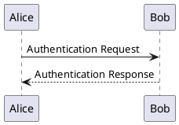

# PlantUML

As an alternative to Mermaid, you can also use PlantUML with the PlantUML plugin for Typemill. PlantUML supports advanced UML charts and is widely used in IT departments for technical documentation. 

Use the following code: 

    ```plantuml-diagram align="center" padding="10px" size="600px"
    @startuml
    Alice -> Bob: Authentication Request
    Bob --> Alice: Authentication Response
    @enduml
    ```

Get the following result:



You can download the [PlantUML Plugin](https://plugins.typemill.net/plantuml) and use it for free (MIT license). 

