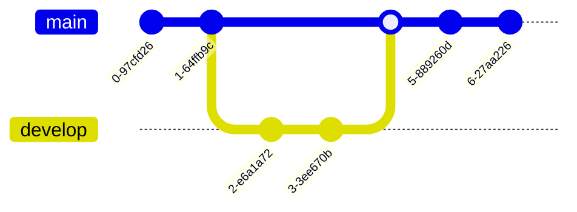

#  Mermaid Plugin

Mermaid is a highly popular and markdown-inspired language for creating all kinds of charts and diagrams. This plugin is especially useful for various types of documentation and informational websites. The Mermaid plugin is free to use.

To create Mermaid charts in Typemill, simply use a code block, specify the language as "mermaid," and add the Mermaid syntax into the code block. It might be necessary to reload the page if you want to see the Mermaid diagram in the editor.

To get started with the Mermaid syntax, check the [live editor](https://mermaid.live/) for Mermaid. Mermaid also provides a [GPT](https://chatgpt.com/g/g-1IRFKwq4G-mermaid-chart-diagrams-and-charts) that you can use in ChatGPT. Additionally, you can use the Mermaid [prompt in Kixote](/author-guide/ai-with-kixote) to add Mermaid charts to your page.

## Flowcharts

## Sequence Diagram

## Class Diagram

## State Diagram

## ER Diagram

## Gantt Chart

## User Journey

## Git Graph

## Pie Chart

## Mindmap

## Quadrant Chart

## XY Chart

